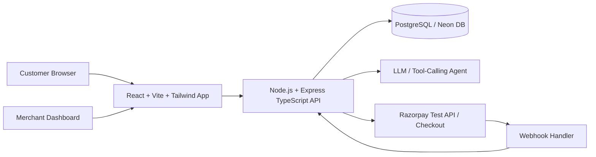

# PayPilot AI — Merchant Growth & Agentic Commerce

> **Razorpay Buildathon — Track 1: AI Growth & Agentic Commerce**  
> An AI-native commerce system that converts natural-language customer intent into a curated purchase journey, with tool-grounded recommendations, bounded checkout, server-side policy enforcement, Razorpay test-mode integration, and an immutable audit trail.

---

## 🚀 Key Highlights & Architectural Principles

- 🧠 **Intent-to-Action Engine:** Structured intent parsing converting customer requests into precise catalog filters without model hallucination.
- 🛡️ **Bounded Authority & Policy Gate:** The AI proposes actions; server-side deterministic policy guardrails validate spend caps (e.g. ₹80,000 ceiling), discount limits, and inventory.
- 💳 **Razorpay Test Integration:** Server creates test-mode orders in paise (`POST /v1/orders`), frontend initiates standard Razorpay Checkout SDK, and backend verifies authenticity via HMAC SHA256 signatures.
- 📜 **Full Audit & Decision Replay:** Every session, tool call, policy evaluation, and payment outcome is recorded in an immutable audit timeline.
- 📊 **Merchant Growth Telemetry:** Real-time analytics tracking AI-assisted sessions, conversion rates, upsell acceptance, and policy blocks.

---

## 🏛️ System Architecture



---

## 📁 Repository Structure

```text
paypilot-ai/
├── apps/
│   ├── web/               # React 18, TypeScript, Vite, Tailwind CSS
│   └── api/               # Express, TypeScript, Zod, Prisma, Pino
├── prisma/
│   ├── schema.prisma      # 14 Relational models for commerce, agent & payments
│   └── seed.ts            # Realistic synthetic electronics catalog
├── docs/                  # Engineering specifications and flow diagrams
├── architecture/          # Architecture documentation & diagrams
├── scripts/               # Utility and validation scripts
├── tests/                 # Unit and integration test suites
├── .env.example           # Environment template
└── package.json           # Monorepo workspaces configuration
```

---

## ⚡ Quickstart & Local Setup

### 1. Prerequisites
- **Node.js**: v22.x or higher (`v24.x` supported)
- **npm**: v10.x or higher
- **PostgreSQL**: Neon Cloud Postgres or local PostgreSQL instance

### 2. Installation
```bash
# Clone the repository
git clone <your-repo-url>
cd paypilot-ai

# Install all workspace dependencies
npm install
```

### 3. Environment Configuration
Copy `.env.example` to `.env` and fill in your connection details:
```bash
cp .env.example .env
```
Ensure your `DATABASE_URL` is set in `.env`.

### 4. Database Setup & Seeding
```bash
# Push Prisma schema to PostgreSQL
npm run db:push

# Seed demo merchant, policies, and products catalog
npm run db:seed
```

### 5. Run the Application
```bash
# Start both Backend API (:5000) and Frontend (:5173) concurrently
npm run dev
```

- **Frontend App:** [http://localhost:5173](http://localhost:5173)
- **Backend API Diagnostics:** [http://localhost:5000/health](http://localhost:5000/health)

---

## 🧪 Demo Credentials (Pre-seeded)

| Role | Email | Password | Purpose |
|---|---|---|---|
| **Merchant** | `merchant@paypilot.ai` | `MerchantPass@123` | Policy management, analytics, audit replay |
| **Customer** | `customer@paypilot.ai` | `CustomerPass@123` | Conversational shopping & test checkout |

---

## 📄 License
This project is licensed under the [MIT License](LICENSE).
