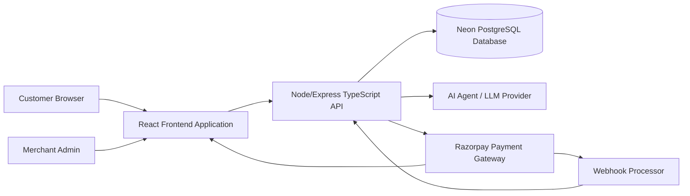
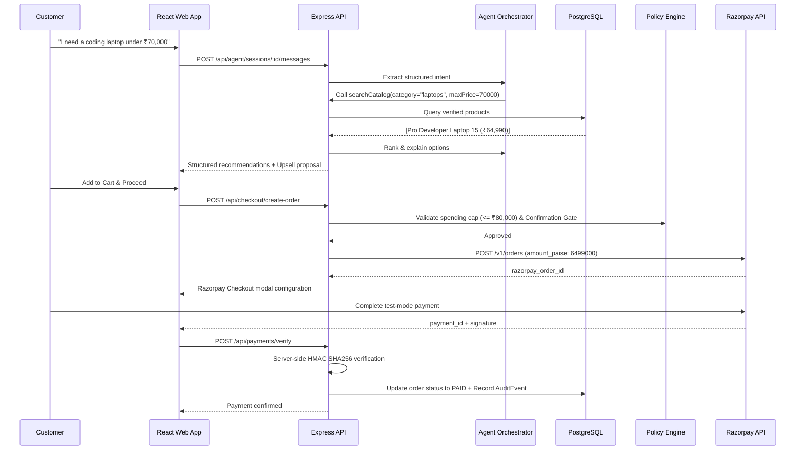

# PayPilot AI Architecture & Data Flows

## 1. System Context Diagram



## 2. Intent-to-Payment Bounded Flow



## 3. Relational Entity Relationship Overview

```text
User ──────────────< Merchant ──────────────< Product
 │                      │                        │
 │                      ├───1 MerchantPolicy      │
 │                      │                        │
 │                      └───< Order >────── OrderItem
 │                              │
 ├───< AgentSession >─── AgentEvent / Message
 │
 └───< Cart >────────── CartItem >────────── Product
```
