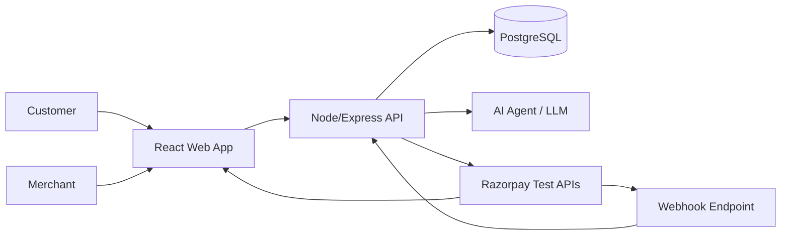
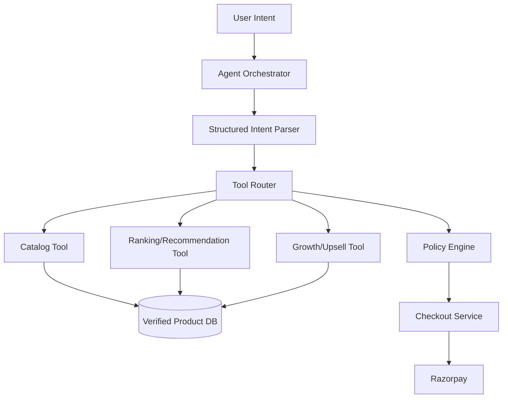
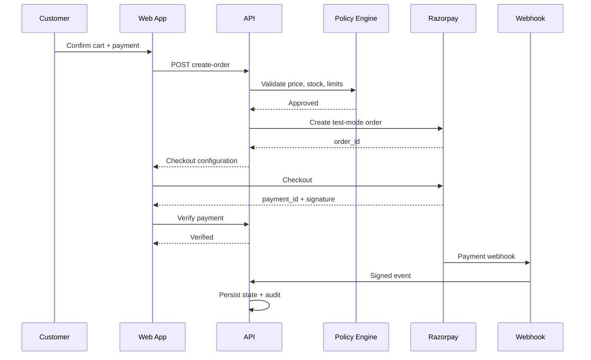

# GitHub Repository, README, Diagrams and Submission Package

## 1. Repository philosophy

The repository is part of the interview artifact. A reviewer should be able to answer within minutes:

1. What problem is solved?
2. Why is AI necessary?
3. How does money move through the system?
4. What prevents an AI mistake from becoming a payment mistake?
5. How do I run it?
6. What failed during development?
7. What did the team measure?

## 2. Recommended repository structure

```text
paypilot-ai/
│
├── apps/
│   ├── web/
│   │   ├── src/
│   │   │   ├── components/
│   │   │   ├── pages/
│   │   │   ├── features/
│   │   │   ├── hooks/
│   │   │   ├── lib/
│   │   │   └── types/
│   │   └── package.json
│   │
│   └── api/
│       ├── src/
│       │   ├── config/
│       │   ├── middleware/
│       │   ├── modules/
│       │   │   ├── auth/
│       │   │   ├── products/
│       │   │   ├── agent/
│       │   │   ├── cart/
│       │   │   ├── checkout/
│       │   │   ├── payments/
│       │   │   ├── webhooks/
│       │   │   ├── analytics/
│       │   │   └── audit/
│       │   ├── integrations/
│       │   │   ├── razorpay/
│       │   │   └── ai/
│       │   ├── shared/
│       │   └── server.ts
│       └── package.json
│
├── prisma/
│   ├── schema.prisma
│   ├── migrations/
│   └── seed.ts
│
├── docs/
│   ├── 01_PROJECT_OVERVIEW.md
│   ├── 02_FEATURES_ROLES_FLOWS.md
│   ├── 03_END_TO_END_FLOWS.md
│   ├── 04_DATABASE_DESIGN.md
│   ├── 05_API_ROUTES.md
│   ├── 06_TECH_STACK_PREREQUISITES.md
│   ├── 07_GITHUB_REPO_AND_DOCUMENTATION.md
│   ├── 08_ARCHITECTURE_PROJECT_STRUCTURE.md
│   ├── 09_3_DAY_EXECUTION_PLAN.md
│   └── 10_AI_SECURITY_TESTING_DEPLOYMENT.md
│
├── architecture/
│   ├── system-context.png
│   ├── container-diagram.png
│   ├── sequence-checkout.png
│   ├── agent-flow.png
│   └── state-machines.png
│
├── scripts/
├── tests/
├── .env.example
├── .gitignore
├── README.md
├── LICENSE
└── package.json
```

## 3. Root README structure

### Section 1 — Hero

```text
PayPilot AI
Merchant Growth & Agentic Checkout

AI that turns customer intent into a verified, bounded commerce workflow.
```

Include:

- 1 demo GIF/video thumbnail.
- Track 1 badge.
- live demo link if stable.
- GitHub status badges only if meaningful.

### Section 2 — Problem

Three paragraphs max.

### Section 3 — Solution

Explain the intent-to-action loop.

### Section 4 — Demo

Add 60–90 second GIF or video.

### Section 5 — Architecture

Embed system diagram.

### Section 6 — AI design

Explain:

- structured intent
- tools
- grounding
- ranking
- policy layer
- audit

### Section 7 — Razorpay integration

Explain test-mode order creation, Checkout, verification and webhooks.

### Section 8 — Safety / guardrails

Explain how the LLM is prevented from directly performing uncontrolled money actions.

### Section 9 — Metrics

Show real demo measurements with methodology.

### Section 10 — Failure story

Show one genuine engineering failure and the fix.

### Section 11 — Setup

One command path wherever possible.

### Section 12 — API

Link to OpenAPI/Postman collection.

## 4. Architecture diagrams

### A. System context diagram



### B. Agent architecture



### C. Payment sequence



## 5. API documentation

Generate an OpenAPI document for the important routes.

At minimum document:

- auth
- products
- agent session
- cart
- checkout
- verify payment
- webhook
- orders
- analytics
- audit

## 6. Git strategy

Use short-lived feature branches:

```text
main
  |
  +-- feat/catalog
  +-- feat/agent
  +-- feat/checkout
  +-- feat/audit
  +-- feat/analytics
```

Merge only after a local test.

## 7. Commit standards

Good:

```text
feat: add catalog search tool
feat: implement checkout policy validation
fix: verify webhook using raw request body
docs: add payment sequence diagram
test: cover duplicate webhook handling
```

Avoid:

```text
final
final2
last
working
changes
```

## 8. GitHub issue board

Create columns:

```text
Backlog -> Ready -> In Progress -> Review -> Done
```

Issue labels:

```text
feature
bug
security
ai
payment
backend
frontend
docs
critical
```

## 9. Pull request checklist

```text
[ ] requirement linked
[ ] code builds
[ ] tests pass
[ ] no secrets
[ ] API contract updated
[ ] audit event added if relevant
[ ] error path handled
[ ] README/docs updated
```

## 10. Demo data

Seed a realistic but clearly synthetic merchant catalog.

Example categories:

- laptops
- monitors
- keyboards
- mice
- headphones
- webcams

Create bundles around plausible customer intents.

## 11. Submission checklist

Before submitting:

```text
[ ] Public repo works from clean clone
[ ] README is complete
[ ] .env.example exists
[ ] No secrets committed
[ ] Demo data seed script works
[ ] Architecture diagram included
[ ] 5-minute video ready
[ ] Failure story ready
[ ] Metrics documented
[ ] Razorpay integration uses test keys
[ ] Payment verification implemented
[ ] Webhook signature validation implemented
[ ] Audit trail visible
[ ] Track 1 clearly stated
```

The official Buildathon page explicitly asks for a public repo, a 5-minute pitch video and architecture, and says the code is treated as the resume. https://razorpay.com/buildathon/
